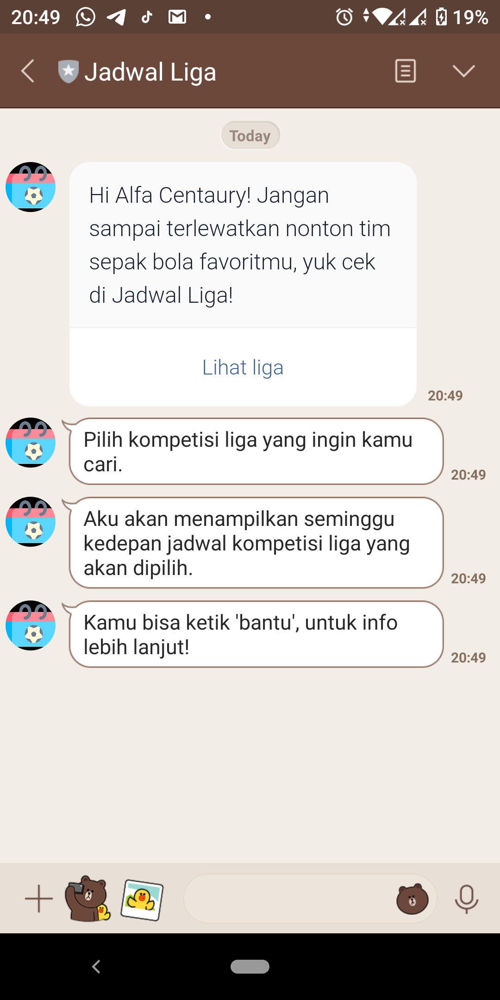
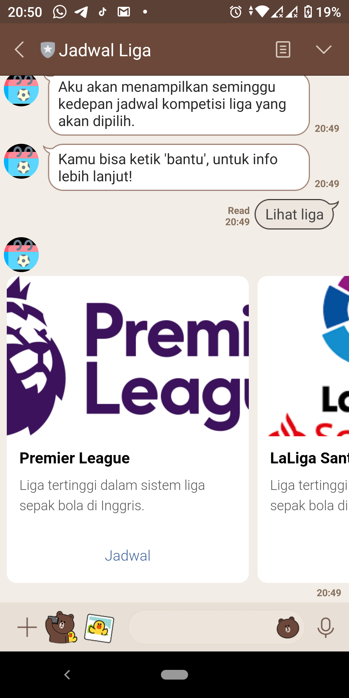
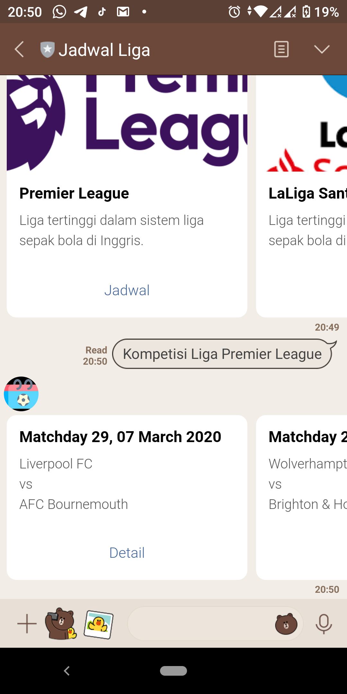
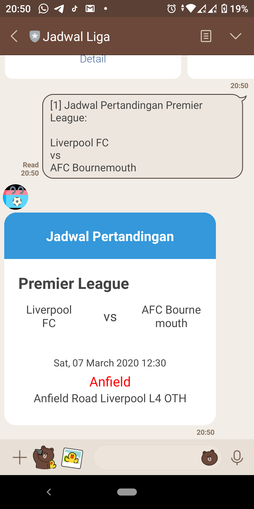
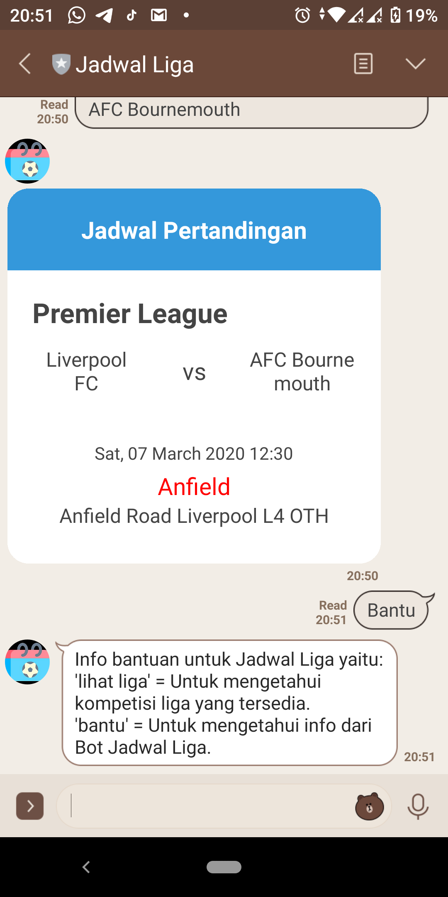

# Learned Membangun LINE Chatbot Academy Dicoding

This repository explains about learning to build a Bot LINE application using LINE Chatbot with the java programming language. 
Jadwal Liga Bot will help you find out and display the league competition schedule available for the coming week using the API [Football-data.org](https://www.football-data.org).

  
  
  

 

  
  

  
 
 

#### The repository has following packages:

1. **assets**: It contains all images for README.
2. **src**: Implementation of all services in the application.

### Library reference resources:

1. LINE Bot SDK Java: https://github.com/line/line-bot-sdk-java
2. LINE Messaging API: https://developers.line.biz/en/docs/messaging-api/overview/
3. Spring Boot Gradle: https://docs.spring.io/spring-boot/docs/2.2.4.RELEASE/gradle-plugin/reference/html/
4. Apache HttpComponents: https://mvnrepository.com/artifact/org.apache.httpcomponents
5. Jsoup : https://jsoup.org/download

## Noted

Please use this as a reference only. Hope this helps you develop more projects.

